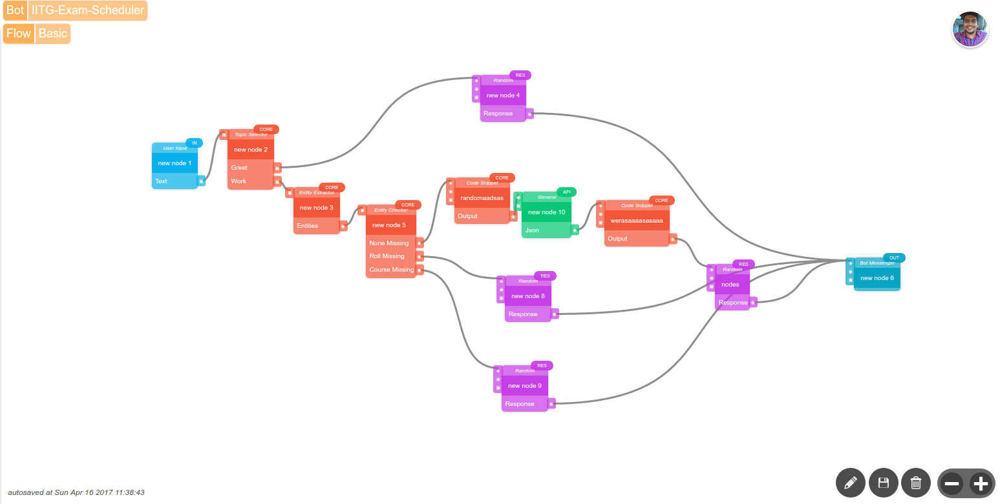

# MyPolly Botathon 2017, IIT Guwahati

This repository contains team **sudo**'s submission for 
[Datalog.ai](http://www.datalog.ai/) [MyPolly](http://mypolly.ai/) botathon.
 
Problem Statement
-----------------

We have built a chatbot for answering exam venue 
and exam date related queries. 

* We scrapped exam time table from IIT Guwahati 
Academic Section website and served the responses
using a Python (django-rest-framework) API.  
* The user is asked to enter course number and 
roll number.

Screenshots of Bot Flow
-----------------------

Example Conversation 1
------------------------
:computer: : Hello! Nice to meet you. Please use me to know your exam date and venue.  
:boy: : My roll number is 130101075.  
:computer: Please provide a valid course number.  
:boy: : CS101  
:computer: Your exam date is 29-May-2017 and the venue is Lecture Theatre 1. Best of Luck!

Example Conversation 2
------------------------
:computer: : Hello! Nice to meet you. Please use me to know your exam date and venue.  
:boy: : CS101 for 130101075.   
:computer: Your exam date is 29-May-2017 and the venue is Lecture Theatre 1. Best of Luck!

Chatbot JSON File
-----------------

*chatbot.json* is chat bot JSON File downloaded from apps.mypolly.ai 
dashboard.

Team 
-----
Team Name: **SUDO**

* Ashish Agarwal
* Narendra Choudhary
* Tushar Dubey
